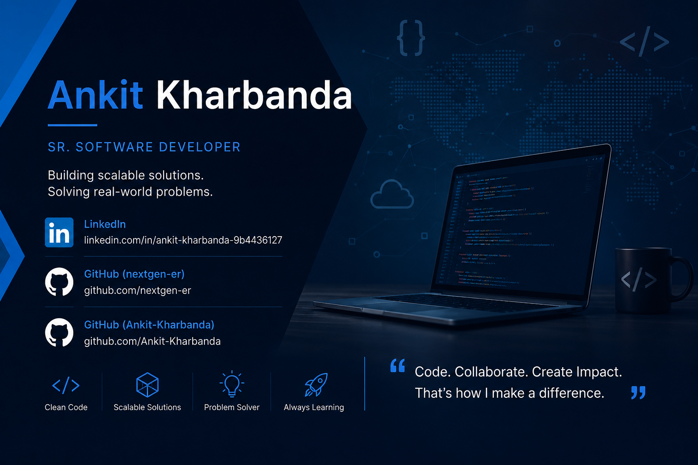

  

# Hi, I'm Ankit Kharbanda 👋

## Senior Software Developer

Experienced Full Stack Developer with 5+ years of experience building scalable web applications, APIs, integrations, and cloud-native solutions.

---

## 🚀 Tech Stack

### Frontend
- React.js
- JavaScript (ES6+)
- HTML5
- CSS3
- Bootstrap

### Backend
- Node.js
- Express.js
- FastAPI
- Laravel

### Databases
- MongoDB
- PostgreSQL
- MySQL

### DevOps & Cloud
- Docker
- Nginx
- Linux
- GitHub Actions

### Messaging & Monitoring
- Kafka
- Prometheus
- Grafana

---

## 💼 Professional Experience

### Portal 1
**Tech Stack:** MongoDB, React.js, Node.js

- REST APIs
- Authentication & Authorization
- Scalable Architecture

### Portal 2
**Tech Stack:** MySQL, React.js, Node.js

- Docker Deployment
- Enterprise Workflows
- Reporting Modules

### Portal 3
**Tech Stack:** MySQL, React.js, Laravel

- Dockerized Environment
- Data Synchronization
- API Integrations

---

## 🔥 Current Interests

- Microservices Architecture
- Event-Driven Systems
- Apache Kafka
- Generative AI (GenAI)
- Agentic AI Systems
- AI-Powered Application Development
- FastAPI
- Cloud-Native Architectures
- AWS & Azure Solutions
- DevOps Automation
- Container Orchestration (Kubernetes)

## 🎓 Professional Development

🔹 PGP in Multicloud Architecture in DevOps (In Progress)

🔹 Certification Program in Generative AI (In Progress)

### Focus Areas

- AWS Solutions Architecture
- Microsoft Azure
- DevOps & Cloud Automation
- Generative AI Applications
- Agentic AI Systems
- LLM Integration

---

## 📊 GitHub Stats

---

## 🔗 Professional Profiles

### LinkedIn
https://www.linkedin.com/in/ankit-kharbanda-9b4436127

### GitHub (Primary)
https://github.com/nextgen-er

### GitHub (Secondary)
https://github.com/Ankit-Kharbanda

---

> Building scalable software, solving real-world problems, and continuously learning.
